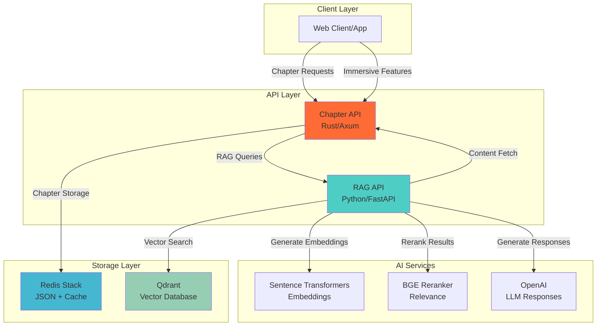

# Chapter-Based RAG System 📚

*An intelligent reading platform that combines fast chapter delivery with AI-powered contextual understanding*

## 🌟 Overview

This project demonstrates a modern, scalable approach to building intelligent reading systems by combining:

1. **Chapter API** (Rust): A high-performance service for managing and serving novel chapters with immersive reading features
2. **RAG API** (Python): An advanced Retrieval-Augmented Generation service that provides contextual Q&A, mood analysis, and story insights

The system is designed as a practical exploration of Rust and Python development with cutting-edge RAG technology, specifically optimized for chapter-based storytelling content like novels, serialized fiction, and narrative experiences.

### ✨ Key Features

- **Lightning-fast chapter delivery** with intelligent caching
- **Immersive reading experience** with mood analysis and emotional journey tracking  
- **Contextual Q&A** powered by vector search and large language models
- **Smart chunking** optimized for narrative content
- **Real-time analysis** of character development and plot mysteries
- **RESTful APIs** with comprehensive documentation
- **Docker-ready deployment** with Redis Stack and Qdrant integration

## 🛠 Technologies & Architecture

### Chapter API (Rust)
- **Framework**: Axum with Tokio async runtime
- **Storage**: Redis Stack with JSON support
- **HTTP Client**: Reqwest with rustls-tls
- **Observability**: Tracing with structured logging
- **Data**: Serde for JSON serialization
- **Additional**: Tower middleware, Anyhow error handling, file watching, async utilities

### RAG API (Python)
- **Framework**: FastAPI with async support
- **Vector Database**: Qdrant for similarity search
- **Embeddings**: Sentence Transformers (e5-large-v2)
- **Reranking**: BAAI/bge-reranker-v2-m3 for relevance optimization
- **LLM Integration**: OpenAI API for contextual responses
- **ML Stack**: PyTorch, NumPy, Scikit-learn
- **Additional**: LangChain, Uvicorn server, development utilities

### System Architecture



### 🏗 Core Components

#### Chapter API (Rust)
The high-performance backend service that handles:
- **Chapter Management**: Fast retrieval with Redis JSON storage and intelligent caching
- **Immersive Features**: Mood analysis, emotional journey tracking, and mystery element detection
- **Search Capabilities**: Full-text search across chapter titles and content
- **Smart Integration**: Seamless communication with RAG API for enhanced features
- **Performance Optimization**: Async processing, connection pooling, and efficient batch operations

#### RAG API (Python)  
The intelligent content analysis service featuring:
- **Advanced Chunking**: Specialized algorithms for narrative content segmentation
- **Vector Operations**: High-dimensional embeddings with optimized similarity search
- **Contextual Understanding**: Multi-model approach combining embeddings, reranking, and LLM generation
- **Story Intelligence**: Character tracking, plot analysis, and thematic understanding
- **Flexible Architecture**: Modular design supporting multiple embedding models and LLM providers

## 🚀 Quick Start

### Option 1: Docker Compose (Recommended)

Perfect for development and testing with all services pre-configured:

```bash
# Clone the repository
git clone <repository-url>
cd chapter-api

# Start all services (Redis, Chapter API, RAG API, Qdrant)
docker compose up --build

# Services will be available at:
# - Chapter API: http://localhost:3000
# - RAG API: http://localhost:8001  
# - Redis Insight: http://localhost:8002
# - Qdrant Dashboard: http://localhost:6333/dashboard
```

### Option 2: Local Development

For active development with hot reloading:

```bash
# Prerequisites: Rust, Python 3.9+, Redis, Qdrant

# 1. Set up environment variables
cp .env.example .env
# Edit .env with your OpenAI API key and preferences

# 2. Start Chapter API
cd chapter-api
cargo run

# 3. Start RAG API (in another terminal)
cd ../rag-api
pip install -r requirements.txt
python main.py

# 4. Load sample chapters
curl -X POST http://localhost:3000/admin/reload
curl -X POST http://localhost:8001/index-chapters
```

## 🔧 Configuration

### Environment Variables

#### Chapter API (.env)
```bash
REDIS_URL=redis://127.0.0.1:6379
CHAPTERS_DIR=./chapters
PORT=3000
AUTO_LOAD=true
RAG_SERVICE_URL=http://127.0.0.1:8001
RUST_LOG=info,chapter_api=debug
```

#### RAG API (.env)
```bash
OPENAI_API_KEY=your_openai_api_key_here
QDRANT_URL=http://localhost:6333
CHAPTER_API_URL=http://localhost:3000
EMBEDDING_MODEL=sentence-transformers/e5-large-v2
RERANKER_MODEL=BAAI/bge-reranker-v2-m3
```

## 📖 API Reference

### Chapter API Endpoints

#### 🏥 Health & Monitoring
- `GET /health` - Service health check with dependency status
- `GET /stats` - Detailed API usage statistics and performance metrics

#### 📚 Chapter Operations  
- `GET /chapters/{number}` - Retrieve individual chapter (supports `?summary=true`)
- `GET /chapters` - Batch chapter retrieval with pagination (`?start=1&end=10&limit=50`)

#### 🔍 Search & Discovery
- `GET /search` - Full-text search across chapters (`?q=keyword&limit=10`)

#### ✨ Immersive Reading Features
- `GET /immersive/chapters/{number}` - Enhanced chapter with mood analysis (`?include_recap=true`)
- `POST /immersive/question` - Contextual Q&A about story content
- `GET /immersive/emotions/{number}` - Emotional journey visualization  
- `GET /immersive/mystery/{number}` - Mystery elements and plot analysis
- `POST /immersive/cache/refresh` - Refresh intelligent story cache
- `GET /immersive/cache/status` - Monitor cache performance
- `GET /immersive/analysis/status/{number}` - Check analysis completion status

#### ⚙️ Administration
- `POST /admin/reload` - Hot-reload chapters from filesystem
- `POST /admin/flush` - Clear Redis cache and reset state

### RAG API Endpoints

#### 🤖 Intelligence Operations
- `POST /query` - Advanced contextual queries with reranking
- `POST /index-chapters` - Process and index chapter content for search
- `GET /example-queries` - Curated examples demonstrating capabilities

#### 📊 System Information  
- `GET /chapters` - List indexed chapters with metadata
- `GET /health` - Health check with model status
- `GET /stats` - Vector database statistics and performance metrics

### 🌟 Example Usage

```bash
# Get a chapter with mood analysis
curl "http://localhost:3000/immersive/chapters/1?include_recap=true"

# Ask contextual questions about the story
curl -X POST "http://localhost:3000/immersive/question" \
  -H "Content-Type: application/json" \
  -d '{
    "question": "What are the main character motivations in this chapter?",
    "current_chapter": 5,
    "include_context": true
  }'

# Search for chapters about specific themes
curl "http://localhost:3000/search?q=betrayal&limit=5"

# Get emotional analysis for character development
curl "http://localhost:3000/immersive/emotions/12"
```

## 🧪 Development & Testing

### Running Tests

```bash
# Chapter API (Rust)
cd chapter-api
cargo test --all-features
cargo test --doc  # Documentation tests

# RAG API (Python)  
cd rag-api
pytest tests/ -v
pytest --cov=src tests/  # With coverage
```

### Code Quality

```bash
# Formatting
cargo fmt              # Rust formatting
black rag-api/         # Python formatting  
isort rag-api/         # Python import sorting

# Linting
cargo clippy           # Rust linting
flake8 rag-api/        # Python linting
mypy rag-api/          # Python type checking
```

### Performance Monitoring

The system includes comprehensive observability:

- **Structured Logging**: JSON-formatted logs with correlation IDs
- **Metrics Collection**: Request/response times, cache hit rates, vector search performance
- **Health Checks**: Dependency status monitoring for Redis, Qdrant, and OpenAI
- **Error Tracking**: Detailed error context with stack traces and request metadata

## 🚢 Deployment

### Production Docker Deployment

```yaml
# docker-compose.prod.yml
version: '3.8'
services:
  chapter-api:
    build: ./chapter-api
    environment:
      - RUST_LOG=info
      - REDIS_URL=redis://redis:6379
    depends_on: [redis, rag-api]
    
  rag-api:
    build: ./rag-api  
    environment:
      - OPENAI_API_KEY=${OPENAI_API_KEY}
      - QDRANT_URL=http://qdrant:6333
    depends_on: [qdrant]
    
  redis:
    image: redis/redis-stack:latest
    volumes: [redis_data:/data]
    
  qdrant:
    image: qdrant/qdrant:latest
    volumes: [qdrant_data:/qdrant/storage]
```

### Environment-Specific Configuration

- **Development**: Auto-reload, debug logging, local file watching
- **Staging**: Production builds with test data and monitoring  
- **Production**: Optimized builds, structured logging, health checks, metrics

## 🎯 Performance Characteristics

### Chapter API (Rust)
- **Latency**: Sub-10ms response times for cached chapters
- **Throughput**: 10,000+ requests/second on modern hardware
- **Memory**: ~50MB baseline, scales with cache size
- **Concurrency**: Handles thousands of concurrent connections

### RAG API (Python)
- **Vector Search**: ~100ms for similarity search across 10k+ chunks
- **Embedding Generation**: ~200ms for chapter-length content
- **LLM Response**: 1-3 seconds depending on model and complexity
- **Memory**: ~2GB with loaded models, scales with vector index size

## 📋 Best Practices & Guidelines

### 🏛 Architecture Principles

1. **Microservices Design**: Loosely coupled services with clear responsibilities
2. **Async-First**: Non-blocking I/O throughout the stack for optimal performance  
3. **Fail-Safe Operations**: Graceful degradation when AI services are unavailable
4. **Data Consistency**: Event-driven updates with Redis as source of truth
5. **Observability**: Comprehensive logging, metrics, and health checks

### 💻 Development Standards

#### Rust (Chapter API)
- Follow official Rust style guidelines (`cargo fmt`)
- Use `clippy` for additional linting (`cargo clippy`)
- Write comprehensive tests for all public APIs
- Document all public functions and modules
- Prefer `Result<T, E>` for error handling over panics
- Use structured logging with `tracing` crate

#### Python (RAG API)
- Follow PEP 8 style guide (enforced with `black` and `flake8`)
- Use type hints for all function signatures  
- Write docstrings for all public functions and classes
- Use `pytest` for testing with appropriate fixtures
- Handle errors gracefully with proper logging
- Use async/await for I/O operations

### 🔒 Security Considerations

- **API Keys**: Never commit secrets; use environment variables
- **Input Validation**: Sanitize all user inputs and API parameters
- **Rate Limiting**: Implement appropriate throttling for public endpoints  
- **CORS**: Configure appropriate cross-origin policies
- **Logging**: Avoid logging sensitive data (API keys, user content)
- **Dependencies**: Regularly audit and update dependencies for security patches

### ⚡ Performance Optimization

- **Caching Strategy**: Multi-layer caching (Redis, in-memory, CDN)
- **Connection Pooling**: Reuse database and HTTP connections
- **Batch Operations**: Group related operations to reduce round-trips
- **Lazy Loading**: Load expensive resources only when needed
- **Compression**: Use appropriate compression for API responses
- **Monitoring**: Track performance metrics and set up alerting