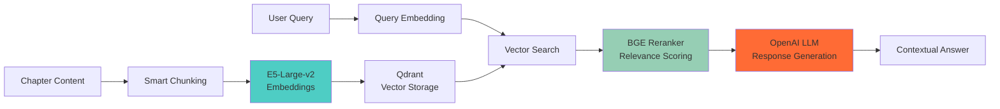

# RAG API 🤖

*An intelligent Retrieval-Augmented Generation service for contextual story understanding and Q&A*

## 🌟 Overview

The RAG API is a sophisticated Python-based service that brings AI-powered contextual understanding to chapter-based content. It combines state-of-the-art embedding models, vector search, and large language models to provide intelligent insights about story content, character development, and narrative analysis.

### ✨ Core Features

- **🔍 Advanced Vector Search**: High-performance similarity search with Qdrant vector database
- **🧠 Intelligent Chunking**: Narrative-optimized content segmentation for better context understanding
- **🎯 Multi-Model Approach**: Combines embeddings, reranking, and LLM generation for superior results
- **📚 Story Intelligence**: Character tracking, plot analysis, and thematic understanding
- **⚡ Fast Processing**: Optimized for real-time chapter analysis and Q&A
- **🔄 Scalable Architecture**: Async-first design supporting high concurrent loads
- **📊 Analytics**: Comprehensive metrics and performance monitoring

## 🏗 Architecture & Technology Stack

### Core Technologies
- **🐍 Python 3.9+**: Modern Python with async/await support
- **⚡ FastAPI**: High-performance async web framework
- **🦄 Uvicorn**: Lightning-fast ASGI server
- **🔍 Qdrant**: Advanced vector database for similarity search
- **🤗 Sentence Transformers**: State-of-the-art embedding models
- **🎯 BGE Reranker**: Cross-encoder for result relevance optimization
- **🤖 OpenAI API**: GPT models for contextual response generation
- **🔬 PyTorch**: Machine learning framework for model inference

### AI Model Pipeline



## 🚀 Quick Start

### 🐳 Docker Setup (Recommended)

```bash
# Using docker-compose from project root
docker compose up rag-api qdrant

# Services available at:
# - RAG API: http://localhost:8001  
# - Qdrant Dashboard: http://localhost:6333/dashboard
```

### 🛠 Local Development

```bash
# Prerequisites: Python 3.9+, Qdrant running locally

# 1. Set up environment
cd rag-api
python -m venv venv
source venv/bin/activate  # On Windows: venv\Scripts\activate

# 2. Install dependencies
pip install -r requirements.txt

# 3. Configure environment variables
cp .env.example .env
# Edit .env with your OpenAI API key and preferences

# 4. Start the service
python main.py

# 5. Verify health
curl http://localhost:8001/health
```

### 🔧 Environment Configuration

| Variable | Default | Description |
|----------|---------|-------------|
| `OPENAI_API_KEY` | *required* | Your OpenAI API key for LLM responses |
| `QDRANT_URL` | `http://localhost:6333` | Qdrant vector database connection |
| `CHAPTER_API_URL` | `http://localhost:3000` | Chapter API for content retrieval |
| `EMBEDDING_MODEL` | `sentence-transformers/e5-large-v2` | Embedding model for vector generation |
| `RERANKER_MODEL` | `BAAI/bge-reranker-v2-m3` | Cross-encoder for result reranking |
| `MAX_CHUNK_SIZE` | `1000` | Maximum characters per content chunk |
| `CHUNK_OVERLAP` | `200` | Overlap between adjacent chunks |
| `TOP_K` | `20` | Number of results to retrieve from vector search |
| `RERANK_TOP_K` | `5` | Number of results to rerank for final response |

## 📖 API Reference

### 🤖 Intelligence Operations
- `POST /query` - Advanced contextual queries with multi-stage processing
- `POST /index-chapters` - Process and index chapter content for intelligent search
- `GET /example-queries` - Curated examples showcasing system capabilities

### 📊 System Information
- `GET /chapters` - List indexed chapters with metadata and statistics
- `GET /health` - Comprehensive health check including model and database status
- `GET /stats` - Vector database statistics, model performance, and usage metrics

### 🔧 Management Operations
- `POST /reindex` - Rebuild vector index with updated parameters
- `DELETE /index` - Clear vector database and reset system state
- `GET /models/status` - Check loaded models and memory usage

## 🌟 Usage Examples

### Basic Query
```bash
curl -X POST "http://localhost:8001/query" \
  -H "Content-Type: application/json" \
  -d '{
    "question": "Who is the main protagonist and what are their key motivations?",
    "chapter_context": 5,
    "include_sources": true
  }'
```

### Advanced Query with Context
```bash
curl -X POST "http://localhost:8001/query" \
  -H "Content-Type: application/json" \
  -d '{
    "question": "How has the character development evolved from the beginning?",
    "chapter_context": 12,
    "include_emotional_analysis": true,
    "max_context_chunks": 10
  }'
```

### Index New Content
```bash
# Index chapters for intelligent search
curl -X POST "http://localhost:8001/index-chapters"

# Check indexing status
curl "http://localhost:8001/stats"
```

## 🧠 AI Capabilities

### Advanced Content Understanding
- **📖 Narrative Analysis**: Understanding of story structure, plot progression, and character arcs
- **🎭 Character Intelligence**: Tracking character development, relationships, and motivations
- **🔮 Foreshadowing Detection**: Identification of hints and mystery elements
- **😊 Emotional Analysis**: Sentiment and emotional journey tracking
- **🎨 Thematic Understanding**: Recognition of recurring themes and symbols

### Query Intelligence
- **🎯 Context-Aware Responses**: Answers that understand story context and chapter progression
- **📚 Multi-Chapter Synthesis**: Combining information across multiple chapters
- **🔄 Follow-up Understanding**: Handling related questions and conversation continuity
- **📊 Evidence-Based Answers**: Responses with specific chapter references and quotes

## 🔬 Technical Details

### Performance Characteristics
- **🚀 Query Latency**: ~100-500ms depending on complexity
- **💾 Memory Usage**: ~2-4GB with loaded models
- **⚡ Throughput**: 100+ queries per minute
- **📈 Scalability**: Horizontal scaling with load balancing support

### Model Specifications
- **Embedding Model**: `sentence-transformers/e5-large-v2`
  - Dimensions: 1024
  - Context Length: 512 tokens
  - Language: Multilingual support
- **Reranker**: `BAAI/bge-reranker-v2-m3`
  - Max Input: 8192 tokens
  - Cross-language capability
- **LLM**: OpenAI GPT-3.5/4
  - Configurable model selection
  - Custom prompt engineering for narrative understanding

## 🧪 Development & Testing

### Running Tests
```bash
# Install test dependencies
pip install -r requirements-dev.txt

# Run all tests
pytest tests/ -v

# Run with coverage
pytest --cov=src tests/ --cov-report=html

# Run specific test categories
pytest tests/test_embeddings.py -v
pytest tests/test_query_processing.py -v
```

### Development Tools
```bash
# Code formatting
black src/ tests/
isort src/ tests/

# Type checking
mypy src/

# Linting
flake8 src/ tests/
pylint src/

# Security scanning
bandit -r src/
```

### Performance Monitoring
The service includes comprehensive observability:
- **Request Tracing**: Detailed logs for query processing pipeline
- **Model Metrics**: Inference times, memory usage, and throughput
- **Vector Database Stats**: Index size, search performance, and storage metrics
- **Error Tracking**: Comprehensive error logging with context

## 🚀 Production Deployment

### Scaling Considerations
- **Model Loading**: Models can be pre-loaded to reduce cold start times
- **Vector Database**: Qdrant supports clustering for large-scale deployments  
- **Caching**: Implement Redis caching for frequently accessed embeddings
- **Load Balancing**: Multiple instances can share the same vector database

### Production Configuration
```yaml
# docker-compose.prod.yml example
rag-api:
  image: rag-api:latest
  environment:
    - OPENAI_API_KEY=${OPENAI_API_KEY}
    - QDRANT_URL=http://qdrant-cluster:6333
    - LOG_LEVEL=info
    - WORKERS=4
  deploy:
    replicas: 3
    resources:
      limits:
        memory: 4G
        cpus: 2.0
```

## 🤝 Contributing

We welcome contributions to improve the RAG API! Areas of interest include:

### Enhancement Opportunities
- **🔧 New Embedding Models**: Integration of latest models for better performance
- **🎯 Query Optimization**: Advanced query understanding and processing
- **📊 Analytics Features**: Enhanced monitoring and performance insights
- **🌐 Multi-Language Support**: Expanded language capabilities
- **⚡ Performance Improvements**: Optimization of inference and search pipelines

### Getting Started
1. Fork the repository and create a feature branch
2. Set up the development environment following the Quick Start guide
3. Make your changes with appropriate tests and documentation
4. Submit a pull request with clear description of improvements

## 📋 Roadmap

### Planned Features
- **🔄 Real-time Learning**: Adaptive improvements based on user interactions
- **🎨 Visual Analysis**: Image and diagram understanding capabilities
- **🗣️ Audio Integration**: Speech-to-text for voice queries
- **📱 Mobile Optimization**: Enhanced mobile API performance
- **🔌 Plugin System**: Extensible architecture for custom analyzers